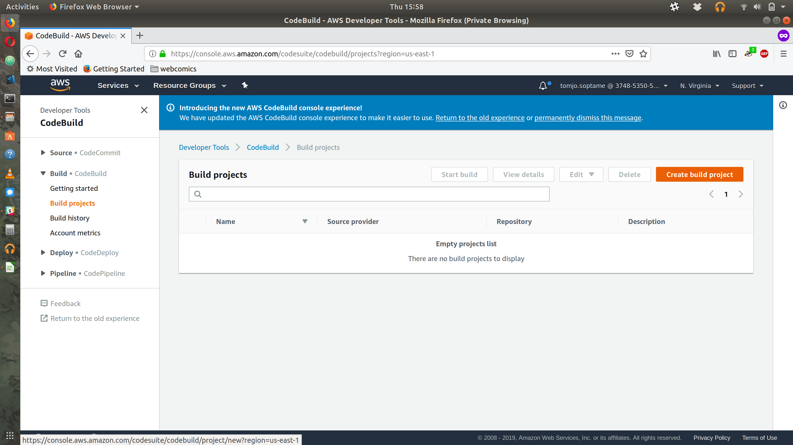
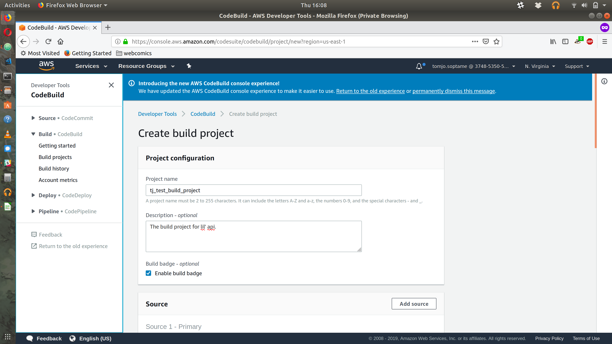
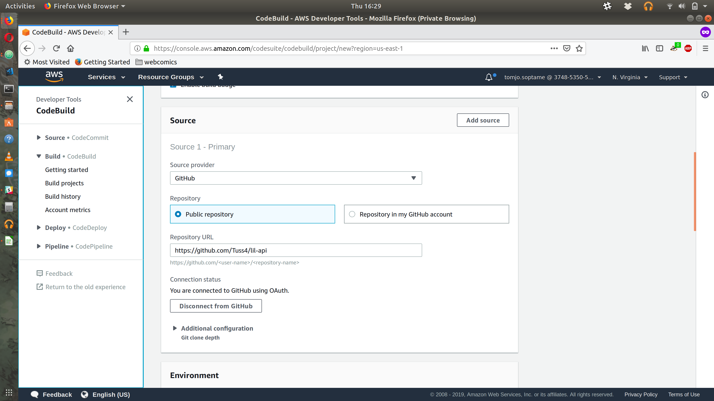
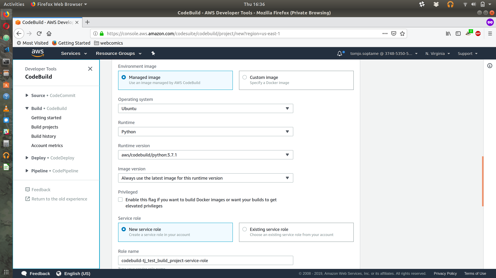
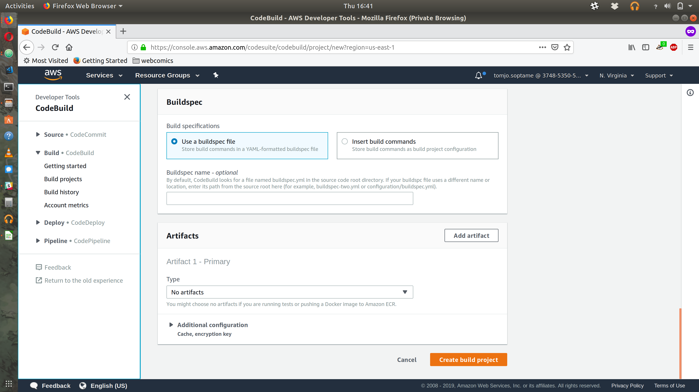
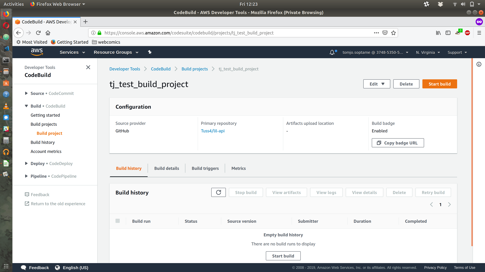
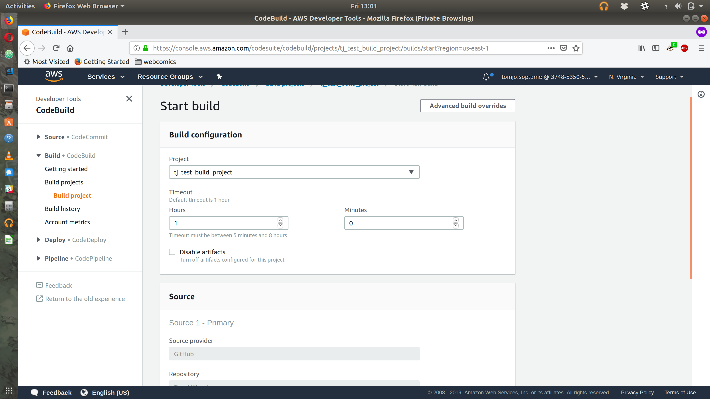
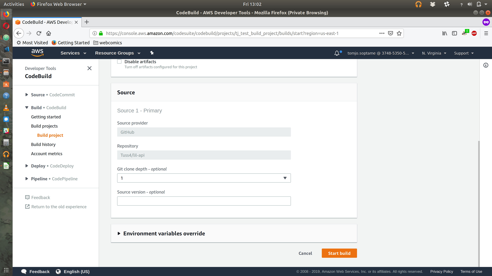

# Setup Your Github Project on AWS CodeBuild
## By TJ Soptame

### Introduction
AWS CodeBuild is a continuous integration service that is a part of the AWS Developer Tools. It compiles your code, runs your tests, and leaves you with a package that can be deployed. The pay structure is that you pay every time a build is run. In this tutorial, we're going to walk through how to setup our CodeBuild project and run our first build. We're going to be using my [Lil' API](https://github.com/Tuss4/lil-api) as our source code.

### Creating a New Build Project
In the top menu, hit the "Services" tab, scroll down to the "Developer Tools" section, and click "CodeBuild". The CodeBuild landing page is pretty straightforward. Right off the bat, you can see your active build projects in the main window. Let's go ahead and click the orange (at the time of writing) "Create build project" button.



In our project configuration feel free to use whatever name and or description you would like. In this case, we went with "tj_test_build_project" and as for the description (totally optional) "The build project for lil' api". If you would like a nice build badge that you can display in your repository's `README.md`, you should definitely check the "Enable build badge" check box!



In the source section, we'll want to set our provider to "GitHub". In order for CodeBuild to access your repositories, you will need to grant it OAuth access to your GitHub account. Once access has been granted, enter your repository's URL into the provided text box.

]

For the environment, to make things simpler, we chose to go with an AWS managed Docker image. Ubuntu for the OS (#DebianFTW) with a Python Runtime (Python 3.7.1!!!). For the image version we chose to use the latest image, however if you would like to isolate your dependencies, you don't have to select that option (for fear of things breaking). Create a new service role and you should be good to go in the environment section!



Now for the Buildspec. This tells CodeBuild how to actually run your build. We opted for using a file called `buildspec.yml` (the default name that CodeBuild looks for). If you name your buildspec file something different, please be sure to specify it in the provided text box.

Sample of Buildspec.yml (can be found in the lil' api repo):

```yaml
version: 0.2
phases:
  pre_build:
    commands:
      - pip3 install -r requirements.txt
  build:
    commands:
- pytest tests.py
```



For now, we're going to select "No artifacts". Let's go ahead and click that orange "Create build project" button.



We are now presented with our build project's page. How do we run a build? By hitting that orange "Start build" button! For this initial build, we'll come across the start build page. For now all the defaults are fine. Hit "Start build" toward the bottom of the page.



Success! We have just run our first build! Have fun!



### Final Thoughts
AWS CodeBuild is a nice CI service with good documentation. The whole build setup process was very intuitive (especially with using a GitHub repo as your build source). I like the fact that the builds are built on top of docker and you have the option to use your own images or you can select some base images (they have a Python 3.7 docker image readily available!!!). The only thing that I had difficulty with was setting up automated builds on a repository that's owned by a GitHub enterprise account.
